<!-- ══════════════════════════ HEADER ══════════════════════════ -->

<picture>
  <source media="(prefers-color-scheme: dark)" srcset="assets/header-dark.svg"/>
  
</picture>

  
  
  

<!-- ══════════════════════════ ABOUT ══════════════════════════ -->

## 👋 About me

Computer science came first **UNBC**, where I picked up the architecture and systems habits I still
build on. What pulled me toward **bioinformatics at Northeastern** was a standard I hadn't met in
product work, in genomics a result doesn't count until someone else can reproduce it. I now build
everything that way assuming someone will try to break it, at a scale I didn't test.

That's the intersection I work at now. I'm not a biologist who picked up Python and I'm not an
engineer who skimmed a genomics tutorial I write the pipelines **and** the platforms they run on.
Clients get the same discipline **software built to survive scrutiny, not just a demo.**

---

<!-- ══════════════════════════ GITHUB ACTIVITY ══════════════════════════ -->

## 📊 GitHub Activity

<picture>
  <source media="(prefers-color-scheme: dark)" srcset="https://github-readme-activity-graph.vercel.app/graph?username=tobioj&theme=tokyo-night&hide_border=true&area=true&custom_title=Contribution%20Activity&line=01BAEF&point=20BF55&radius=8"/>
  
</picture>

<!-- ─────────────────────────────────────────────────────────────────────
     NOT INCLUDED, and why (all tested repeatedly on 2026-08-05):

       github-readme-stats.vercel.app    → HTTP 503  (public instance down)
       github-profile-trophy.vercel.app  → HTTP 402  (Vercel plan exhausted)
       github-profile-summary-cards      → HTTP 500  (all card types)
       streak-stats.demolab.com          → HTTP 200 but renders
                                           "Failed to retrieve contributions"
                                           intermittently. A 200 that shows a
                                           frowny face is still a broken card.

     The first three are what every "awesome profile" template recommends.

     To get a stats card that works reliably AND counts private commits,
     self-host it (~5 min, free) — see PROFILE-SETUP.md §7 — then swap in
     your instance URL and uncomment:

<picture>
  <source media="(prefers-color-scheme: dark)" srcset="https://YOUR-INSTANCE.vercel.app/api?username=tobioj&show_icons=true&include_all_commits=true&count_private=true&hide_border=true&theme=tokyonight&title_color=01BAEF&icon_color=20BF55&border_radius=12"/>
  
</picture>
     ───────────────────────────────────────────────────────────────────── -->

---

<!-- ══════════════════════════ TECH STACK ══════════════════════════ -->

## 🛠️ Tech Stack

<table>
<tr><td valign="top" width="50%">

**Languages**

</td><td valign="top" width="50%">

**Backend & Frameworks**

</td></tr>
<tr><td valign="top" width="50%">

**Data & ML**

**Databases**

</td><td valign="top" width="50%">

**DevOps & Tooling**

</td></tr>
<tr><td valign="top" width="50%">

**Cloud & Deployment**

</td><td valign="top" width="50%">

**Auth, Comms & Integrations**

</td></tr>
<tr><td valign="top" colspan="2">

**Observability & Monitoring**

Error tracking (Sentry / self-hosted GlitchTip), product analytics (PostHog), metrics dashboards
(Grafana), and push alerting (ntfy) — wired into <a href="https://github.com/tobioj/Homelab-Control-Plane">Homelab-Control-Plane</a>
so a failing deploy pages me instead of going unnoticed.

</td></tr>
</table>

**🧬 Bioinformatics & HPC** — the part no template has

  
  
  
  

  
  
  
  
  
  
  
  

---

<!-- ══════════════════════════ FEATURED WORK ══════════════════════════ -->

<!-- ══════════════════════════ EXPERIENCE ══════════════════════════ -->

## 💼 Experience

| Role | Company | When |
|---|---|---|
| **Junior Developer** | Chert System Solutions, Lagos *(remote)* | Jun – Aug 2025 |
| **Software Developer Intern** | Schulltech, MD, US *(remote)* | May – Aug 2024 |
| **Software Developer Intern** | Bluechip Technologies, Lagos | Jun – Aug 2023 |

**Education** — MS Bioinformatics, Northeastern University *(in progress)* · BSc Computer Science, University of Northern British Columbia *(2025)*

---

### 📫 Let's talk

Open to **bioinformatics data engineering** roles, and available for **client builds** —
research-grade rigor, production-grade delivery.

<picture>
  <source media="(prefers-color-scheme: dark)" srcset="assets/footer-dark.svg"/>
  
</picture>

